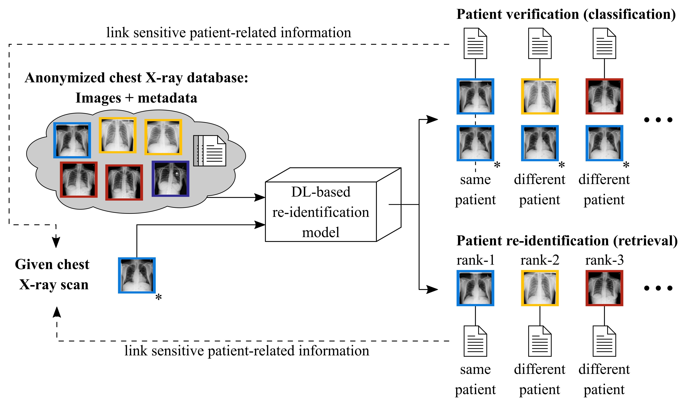

# Code corresponding to the paper "Deep learning-based patient re-identification is able to exploit the biometric nature of medical chest X-ray data"
This repository provides the necessary parts to reproduce the results of our paper. In particular, this repository 
contains the code used to train and evaluate both the patient verification and the patient re-identification models. 

The figure below illustrates the general problem scenario: DL-based patient verification and re-identification 
approaches could allow a potential attacker to link sensitive information from a public dataset to 
an image of interest, highlighting the enormous data security and data privacy issues involved.

<figure>
    
</figure>

 Warning:  
This code is intended to be used for research purposes only. Any attempts to cause harm, in any way whatsoever, are 
strictly prohibited.

## Overview
The overall project is divided into two parts:

1. Patient verification by means of classification techniques
2. Patient re-identification by means of image retrieval techniques

Both subprojects contain separate README files where complete usage instructions are given.

Note that the two subprojects were implemented by two different people. Therefore, they might differ slightly in terms 
of programming style and structure.